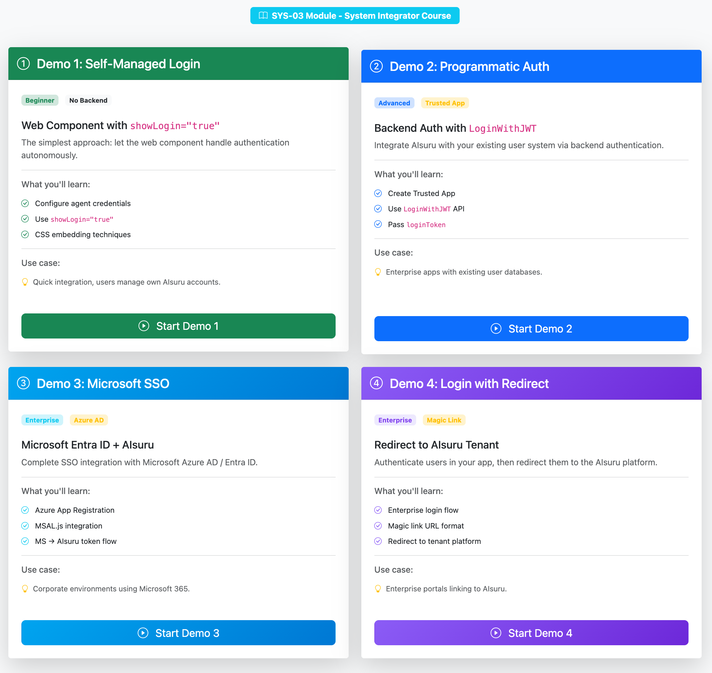

# Embedded Web Component Authentication

> Complete guide to configuring the AIsuru web component with authentication for embedded scenarios

## Overview

This guide covers how to embed the AIsuru web component in your applications and configure authentication to provide personalized AI experiences. You'll learn how to:

- Configure the web component with your agent credentials
- Pass authentication tokens for logged-in users
- Use context variables and initial questions
- Implement secure authentication flows

---

## Demo Application

This module includes **four live demo applications** built with Ruby on Rails 8 + MongoDB that showcase different authentication approaches.



### Quick Start

```bash
# Navigate to the demo folder
cd demo
```

Create a file named `.env_dev` in the `demo/` folder (first time only) with the following content:

```
MONGO_URI=mongodb://mongodb:27017/embedded_webcomponent_auth_development
```

```bash
# Build and start the application (single command)
npm run start

# Open in your browser
open http://localhost:3000
```

### Available Demos

#### Demo 1: Self-Managed Login (`showLogin="true"`)

The simplest approach where the web component handles authentication autonomously.

- Configure web component with agent credentials
- Users login through the built-in authentication panel
- No backend changes required

**Best for:** Public websites, quick integration, no backend changes required.

#### Demo 2: Programmatic Auth with Trusted App

Backend authentication using the `LoginWithJWT` API for seamless SSO.

- Create and configure a Trusted App in your tenant
- Your backend authenticates users via `LoginWithJWT`
- Pass the token to web component via `additionalInfo.loginToken`
- Demo credentials: `demo@demo.com` / `demodemo`

**Best for:** Enterprise applications, existing user systems, SSO requirements.

#### Demo 3: Microsoft SSO (Azure AD / Entra ID)

Complete Single Sign-On integration with Microsoft identity platform.

- Configure Azure App Registration with your `clientId`
- Use MSAL.js for Microsoft authentication in the browser
- Chain Microsoft auth → AIsuru `LoginWithJWT` for seamless SSO
- Users are pre-authenticated in the web component

**Best for:** Corporate environments using Microsoft 365, Azure AD-integrated applications.

#### Demo 4: Login with Redirect

Authenticate users in your app, then redirect them to the AIsuru platform.

- Enterprise login flow with your own credentials
- Use `LoginWithJWT` to obtain an AIsuru token
- Redirect to `https://{tenant}/{lang}/magiclink/{token}`
- Users land on the full AIsuru interface, pre-authenticated
- Demo credentials: `demo@demo.com` / `demodemo`

**Best for:** Enterprise portals, intranet sites, when you want users on the full AIsuru platform.

### Project Structure

```
demo/
├── app/
│   ├── controllers/
│   │   ├── home_controller.rb      # Demo selection page
│   │   ├── demo1_controller.rb     # Demo 1: showLogin
│   │   ├── demo2_controller.rb     # Demo 2: Trusted App auth
│   │   ├── demo3_controller.rb     # Demo 3: Microsoft SSO
│   │   └── demo4_controller.rb     # Demo 4: Redirect to AIsuru
│   ├── models/
│   │   └── user.rb                 # User model (Demo 2, 3, 4)
│   ├── services/
│   │   └── aisuru_auth_service.rb  # AIsuru API integration
│   └── views/
│       ├── home/index.html.erb     # Demo selection
│       ├── demo1/index.html.erb    # Demo 1 page
│       ├── demo2/
│       │   ├── index.html.erb      # Demo 2 main page
│       │   └── login.html.erb      # Demo 2 login page
│       ├── demo3/index.html.erb    # Demo 3 MS SSO page
│       └── demo4/
│           ├── index.html.erb      # Demo 4 main page
│           └── login.html.erb      # Demo 4 login page
├── docker-compose.yml
├── Dockerfile.dev
└── Gemfile
```

### Docker Commands

```bash
# Start the application
docker compose up

# Start in background
docker compose up -d

# Stop the application
docker compose down

# View logs
docker compose logs -f web

# Install/update gems
docker compose run --rm web bundle

# Rails console
docker compose run --rm web rails console
```

---

## Prerequisites

Before starting, you need:

1. An **AIsuru account** at [aisuru.com](https://www.aisuru.com)
2. A configured **AI Agent (Memori)** in your account
3. Access to the **Dev Docs** section of your agent
4. Basic knowledge of HTML and JavaScript

---

## Basic Web Component Setup

### Step 1: Include the Web Component

Add these two lines to your HTML `<head>` or before your closing `</body>` tag:

```html
<!-- AIsuru Web Component -->
<script type="module" src="https://cdn.jsdelivr.net/npm/@memori.ai/memori-webcomponent/dist/memori-webcomponent.js"></script>
<link rel="stylesheet" href="https://cdn.jsdelivr.net/npm/@memori.ai/memori-react/dist/styles.min.css" />
```

### Step 2: Get Your Agent Credentials

Navigate to your agent in AIsuru, then click on **Dev docs** in the left sidebar.

You'll find:

| Field | Description | Example |
|-------|-------------|---------|
| **Memori (Agente) ID** | Unique identifier for your agent | `a1b2c3d4-e5f6-7890-abcd-ef1234567890` |
| **Engine URL** | API endpoint for conversations | `https://engine.memori.ai/memori/v2` |
| **Backend URL** | API endpoint for backend operations | `https://backend.memori.ai/api/v2` |

Expand the **▼ Other references** section to find:

| Field | Description | Example |
|-------|-------------|---------|
| **Secondary Memori (Agent) ID** | Agent ID for web component | `b2c3d4e5-f6a7-8901-bcde-f12345678901` |
| **Owner user ID** | Owner user ID | `c3d4e5f6-a7b8-9012-cdef-123456789012` |

### Step 3: Configure the Web Component

Add the web component to your HTML:

```html
<memori-client
  memoriName="YourAgentName"
  ownerUserName="your.username"
  memoriID="YOUR_MEMORI_ID"
  ownerUserID="YOUR_OWNER_USER_ID"
  tenantID="www.aisuru.com"
  engineURL="https://engine.memori.ai/memori/v2"
  apiURL="https://backend.memori.ai/api/v2"
  baseURL="https://www.aisuru.com"
  layout="CHAT"
  uiLang="EN"
  spokenLang="EN"
  showLogin="true"
></memori-client>
```

---

## Authentication Configuration

### Passing a Login Token

When you have authenticated users in your application, you can pass their authentication token to the web component using the `additionalInfo` attribute:

```html
<memori-client
  memoriName="YourAgentName"
  ownerUserName="your.username"
  memoriID="YOUR_MEMORI_ID"
  ownerUserID="YOUR_OWNER_USER_ID"
  tenantID="www.aisuru.com"
  engineURL="https://engine.memori.ai/memori/v2"
  apiURL="https://backend.memori.ai/api/v2"
  baseURL="https://www.aisuru.com"
  layout="CHAT"
  uiLang="EN"
  spokenLang="EN"
  showLogin="false"
  additionalInfo='{"loginToken":"YOUR_USER_LOGIN_TOKEN"}'
></memori-client>
```

> ⚠️ **Important**: When passing a login token, set `showLogin="false"` since the user is already authenticated.

### Dynamic Token Injection (JavaScript)

For dynamic applications, inject the token via JavaScript:

```html
<memori-client id="memori-widget"></memori-client>

<script>
  const memoriWidget = document.getElementById('memori-widget');

  // Get your user's token from your authentication system
  const userToken = await getUserAuthToken();

  // Configure the widget
  memoriWidget.setAttribute('memoriName', 'YourAgentName');
  memoriWidget.setAttribute('ownerUserName', 'your.username');
  memoriWidget.setAttribute('memoriID', 'YOUR_MEMORI_ID');
  memoriWidget.setAttribute('ownerUserID', 'YOUR_OWNER_USER_ID');
  memoriWidget.setAttribute('tenantID', 'www.aisuru.com');
  memoriWidget.setAttribute('engineURL', 'https://engine.memori.ai/memori/v2');
  memoriWidget.setAttribute('apiURL', 'https://backend.memori.ai/api/v2');
  memoriWidget.setAttribute('baseURL', 'https://www.aisuru.com');
  memoriWidget.setAttribute('layout', 'CHAT');
  memoriWidget.setAttribute('showLogin', 'false');
  memoriWidget.setAttribute('additionalInfo', JSON.stringify({
    loginToken: userToken
  }));
</script>
```

---

## Context Variables and Initial Questions

### Using Context Variables

Pass contextual information to your agent using the `context` attribute. This allows you to customize the agent's behavior based on user or application state:

```html
<memori-client
  ...
  context="ENVIRONMENT:PRODUCTION,LANGUAGE:EN,USER_ID:12345,DEMO:FALSE"
></memori-client>
```

Context variables are passed as comma-separated `KEY:VALUE` pairs.

**Common use cases:**
- `USER_ID`: Identify the current user
- `LANGUAGE`: Set preferred language
- `ENVIRONMENT`: Distinguish between dev/staging/production
- `DEMO`: Enable/disable demo mode
- `ROLE`: User role (admin, user, guest)

### Setting an Initial Question

Pre-populate the conversation with an initial question or instruction:

```html
<memori-client
  ...
  initialQuestion="Hello! I need help with my account."
></memori-client>
```

This can also be used to set instructions for the agent:

```html
<memori-client
  ...
  initialQuestion="Always use formal language and provide detailed explanations."
></memori-client>
```

---

## Obtaining Login Tokens via API

To authenticate users programmatically, use the AIsuru Backend API.

### Option 1: Magic Link Login

Send a magic link to the user's email:

```bash
POST https://backend.memori.ai/api/v2/PwlLogin
Content-Type: application/json

{
  "tenant": "www.aisuru.com",
  "userName": "user@example.com",
  "eMail": "user@example.com"
}
```

### Option 2: JWT Login (Trusted App)

For enterprise SSO integration, use JWT-based authentication. This requires a **Trusted Application** (see section below):

```http
POST https://backend.memori.ai/api/v2/LoginWithJWT
Content-Type: application/json
X-Memori-Trusted-App: YOUR_TRUSTED_APP_API_KEY

{
  "tenant": "www.aisuru.com",
  "jwtToken": "eyJhbGciOiJIUzI1NiJ9..."
}
```

**Response:**

```json
{
  "token": "183c7061-a5f5-4bea-ab2b-e4e6a7bbc3a4",
  "user": {
    "userID": "6057f403-777f-413b-b4f5-5b6ed4ef84b6",
    "userName": "Demo-User",
    "eMail": "demo@demo.com"
  },
  "resultCode": 0,
  "resultMessage": "Ok"
}
```

Use the returned `token` value in the `additionalInfo.loginToken` attribute.

📖 **Full API Reference**: [PwlUser API Documentation](https://docs.aisuru.com/api/backend/pwluser)

---

## Trusted Applications

To use `LoginWithJWT` for programmatic authentication, you need a **Trusted Application**.

### What is a Trusted App?

A Trusted Application is a secure way for your backend to communicate with AIsuru APIs. It allows you to:
- Authenticate users programmatically without them entering AIsuru credentials
- Create seamless SSO experiences
- Manage user sessions from your backend

### Creating a Trusted App

1. Login to your AIsuru tenant as an **administrator**
2. Go to **Admin → Trusted Apps** (or "Applicazioni Fidate" in Italian)
3. Click **+ Create** to add a new Trusted App
4. Fill in:
   - **Name**: A descriptive name (e.g., "My Production App")
   - **Base URL**: Your application's URL (e.g., `http://localhost:3000`)
5. Save and copy the **API Key**

> ⚠️ **Security Warning:** Never expose your Trusted App API Key in frontend code! Always call AIsuru APIs from your backend.

### Using the Trusted App API Key

The authentication flow requires two steps:

#### Step 1: Create a signed JWT

Create a JWT token signed with the Trusted App API Key using HS256 algorithm. In the demo app, this is handled by `app/services/aisuru_auth_service.rb`:

```javascript
// Backend code (Node.js example)
const jwt = require('jsonwebtoken');

const trustedAppApiKey = process.env.AISURU_TRUSTED_APP_KEY;

const jwtToken = jwt.sign(
  {
    sub: user.email,
    email: user.email,
    name: user.name,
    tenant: 'www.aisuru.com',
    iat: Math.floor(Date.now() / 1000),
    exp: Math.floor(Date.now() / 1000) + 300  // 5 minutes
  },
  trustedAppApiKey,
  { algorithm: 'HS256' }
);
```

```ruby
# Backend code (Ruby example - as used in the demo app)
require 'jwt'

jwt_payload = {
  sub: user.email,
  email: user.email,
  name: user.name,
  tenant: tenant_id,
  iat: Time.now.to_i,
  exp: Time.now.to_i + 300  # 5 minutes
}

jwt_token = JWT.encode(jwt_payload, trusted_app_api_key, 'HS256')
```

#### Step 2: Call the LoginWithJWT API

Make a POST request to the AIsuru backend with:
- **Header:** `X-Memori-Trusted-App` containing your API Key
- **Body:** JSON with `tenant` and `jwtToken` fields

```http
POST https://backend.memori.ai/api/v2/LoginWithJWT
Content-Type: application/json
X-Memori-Trusted-App: YOUR_TRUSTED_APP_API_KEY

{
  "tenant": "www.aisuru.com",
  "jwtToken": "eyJhbGciOiJIUzI1NiJ9..."
}
```

### How LoginWithJWT Works (Demo 2 & 3)

```
┌─────────────────┐     ┌─────────────────┐     ┌─────────────────┐
│   Your User     │────▶│   Your Backend  │────▶│  AIsuru API     │
│   (Browser)     │     │                 │     │                 │
└─────────────────┘     └─────────────────┘     └─────────────────┘
        │                       │                       │
        │ 1. Login              │ 2. Create JWT         │
        │                       │ 3. Call LoginWithJWT  │
        │                       │◀──────────────────────│
        │                       │ 4. Receive token      │
        │◀──────────────────────│                       │
        │ 5. Page with          │                       │
        │    loginToken set     │                       │
        ▼                       │                       │
┌─────────────────┐             │                       │
│ Web Component   │─────────────┼──────────────────────▶│
│ (authenticated) │             │                       │
└─────────────────┘             │                       │
```

---

## Microsoft Azure App Registration (Demo 3)

To use Demo 3, you need an Azure App Registration.

### Step 1: Create App Registration

1. Go to [Azure Portal](https://portal.azure.com)
2. Search for **"Microsoft Entra ID"** (formerly Azure AD)
3. Navigate to **App registrations** → **+ New registration**
4. Configure:
   - **Name**: e.g., "AIsuru Demo App"
   - **Supported account types**:
     - "Accounts in any organizational directory" for multi-tenant
     - "Accounts in this organizational directory only" for single-tenant
   - **Redirect URI**: Select **"Single-page application (SPA)"** and enter `http://localhost:3000`

### Step 2: Get Credentials

1. After registration, go to **Overview**
2. Copy the **Application (client) ID** — this is your `clientId`
3. Note the **Directory (tenant) ID** if using single-tenant mode

### Step 3: Configure API Permissions (optional)

Default permissions usually work, but you can verify:
1. Go to **API permissions**
2. Ensure these are present:
   - `User.Read` (delegated)
   - `openid`, `profile`, `email` (delegated)

### How Demo 3 Works

```
┌──────────────┐    ┌──────────────┐    ┌──────────────┐    ┌──────────────┐
│   User       │───▶│  MSAL.js     │───▶│  Your        │───▶│  AIsuru      │
│   Browser    │    │  (MS Auth)   │    │  Backend     │    │  API         │
└──────────────┘    └──────────────┘    └──────────────┘    └──────────────┘
       │                   │                   │                   │
       │ 1. Click          │                   │                   │
       │ "Login with MS"   │                   │                   │
       │──────────────────▶│                   │                   │
       │                   │ 2. MS Login       │                   │
       │                   │    Popup          │                   │
       │◀──────────────────│                   │                   │
       │ 3. Email/Name     │                   │                   │
       │    from MS        │                   │                   │
       │───────────────────┼──────────────────▶│                   │
       │                   │                   │ 4. Create JWT     │
       │                   │                   │    + LoginWithJWT │
       │                   │                   │──────────────────▶│
       │                   │                   │◀──────────────────│
       │                   │                   │ 5. AIsuru token   │
       │◀──────────────────┼───────────────────│                   │
       │ 6. Redirect with  │                   │                   │
       │    loginToken     │                   │                   │
       ▼                   │                   │                   │
┌──────────────┐           │                   │                   │
│ Web Component│           │                   │                   │
│ (pre-auth'd) │           │                   │                   │
└──────────────┘           │                   │                   │
```

---

## Magic Link URL (Demo 4)

After obtaining the `token` from `LoginWithJWT`, you can redirect users to AIsuru using the magic link URL format. In the demo app, this is built by `demo4_controller.rb`:

```
https://{TENANT_BASE_URL}/{LANGUAGE}/magiclink/{TOKEN}
```

**Examples:**
```
https://www.aisuru.com/en/magiclink/183c7061-a5f5-4bea-ab2b-e4e6a7bbc3a4
https://www.aisuru.com/it/magiclink/183c7061-a5f5-4bea-ab2b-e4e6a7bbc3a4
https://your-tenant.aisuru.com/en/magiclink/YOUR_TOKEN
```

**Parameters:**
- `{TENANT_BASE_URL}` — Your AIsuru tenant URL (e.g., `www.aisuru.com`)
- `{LANGUAGE}` — UI language code (`en`, `it`, etc.)
- `{TOKEN}` — The `token` value from `LoginWithJWT` response

---

## Complete Example

Here's a complete HTML example with authentication and context:

```html
<!DOCTYPE html>
<html lang="en">
<head>
  <meta charset="UTF-8">
  <meta name="viewport" content="width=device-width, initial-scale=1.0">
  <title>My AI Assistant</title>

  <!-- AIsuru Web Component -->
  <script type="module" src="https://cdn.jsdelivr.net/npm/@memori.ai/memori-webcomponent/dist/memori-webcomponent.js"></script>
  <link rel="stylesheet" href="https://cdn.jsdelivr.net/npm/@memori.ai/memori-react/dist/styles.min.css" />
</head>
<body>

  <h1>Welcome to My Application</h1>

  <!-- Authenticated AI Agent -->
  <memori-client
    memoriName="MyAssistant"
    ownerUserName="your.username"
    memoriID="YOUR_MEMORI_ID"
    ownerUserID="YOUR_OWNER_USER_ID"
    tenantID="www.aisuru.com"
    engineURL="https://engine.memori.ai/memori/v2"
    apiURL="https://backend.memori.ai/api/v2"
    baseURL="https://www.aisuru.com"
    layout="CHAT"
    uiLang="EN"
    spokenLang="EN"
    showLogin="false"
    additionalInfo='{"loginToken":"USER_AUTH_TOKEN"}'
    context="ENVIRONMENT:PRODUCTION,USER_ROLE:PREMIUM"
    initialQuestion="Welcome! How can I assist you today?"
  ></memori-client>

</body>
</html>
```

---

## Layout Options

The `layout` attribute supports different display modes:

| Value | Description |
|-------|-------------|
| `CHAT` | Standard chat interface |
| `FULLPAGE` | Full-page immersive experience |
| `TOTEM` | Kiosk/totem mode |
| `WEBSITE_ASSISTANT` | Floating assistant widget |

---

## Quick Reference

### Required Attributes

| Attribute | Description |
|-----------|-------------|
| `memoriName` | Name of your agent |
| `ownerUserName` | Your AIsuru username |
| `memoriID` | Agent ID from Dev Docs |
| `ownerUserID` | Owner ID from Dev Docs |
| `tenantID` | Your tenant (e.g., `www.aisuru.com`) |
| `engineURL` | Engine API URL |
| `apiURL` | Backend API URL |
| `baseURL` | Tenant base URL |

### Optional Attributes

| Attribute | Description | Default |
|-----------|-------------|---------|
| `layout` | Display mode | `CHAT` |
| `uiLang` | UI language | `EN` |
| `spokenLang` | Conversation language | `EN` |
| `showLogin` | Show login button | `true` |
| `additionalInfo` | JSON with loginToken and other data | - |
| `context` | Context variables | - |
| `initialQuestion` | Initial message/instruction | - |

---

## Resources

- [AIsuru Documentation](https://docs.aisuru.com/)
- [PwlUser API Reference](https://docs.aisuru.com/api/backend/pwluser)
- [Trusted Application API](https://docs.aisuru.com/api/backend/trustedapplication)
- [Web Component NPM Package](https://www.npmjs.com/package/@memori.ai/memori-webcomponent)
- [Microsoft Identity Platform](https://learn.microsoft.com/en-us/azure/active-directory/develop/)
- [MSAL.js Documentation](https://github.com/AzureAD/microsoft-authentication-library-for-js)

---

📚 [Back to SYS-03 Module](../README.md) | 🏠 [Course Home](../../README.md)
